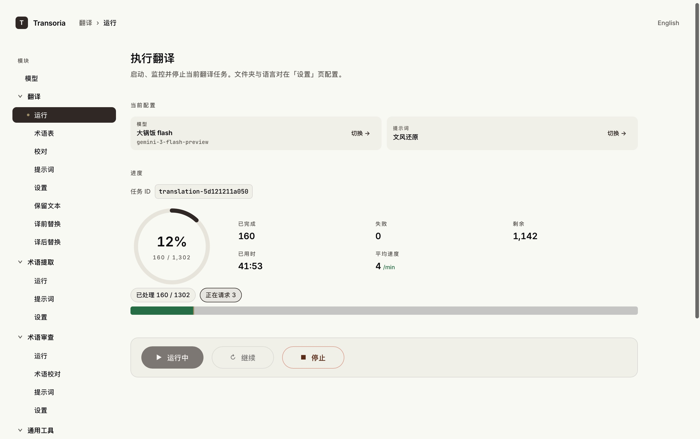
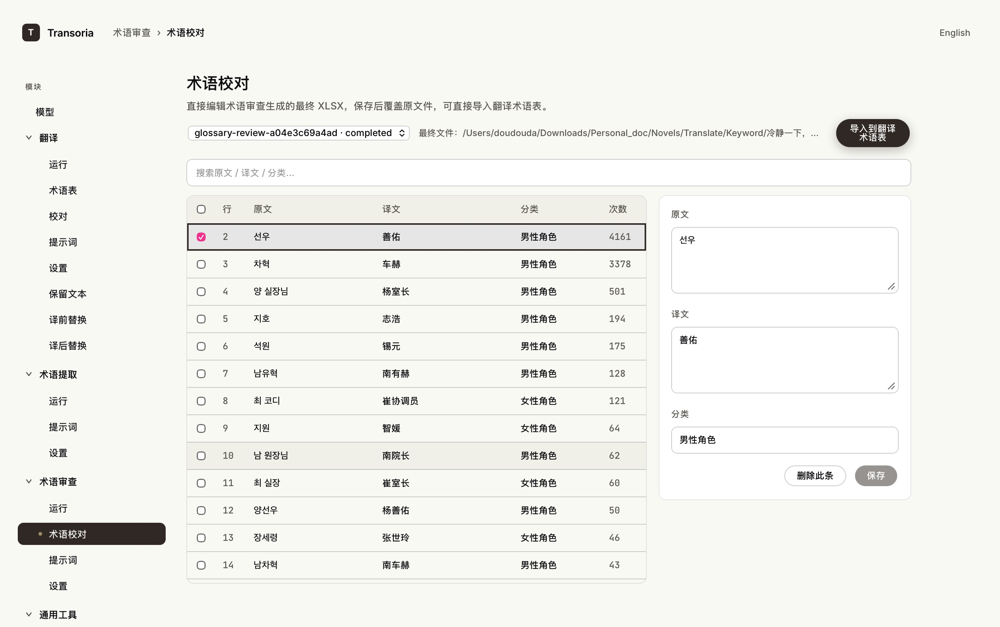
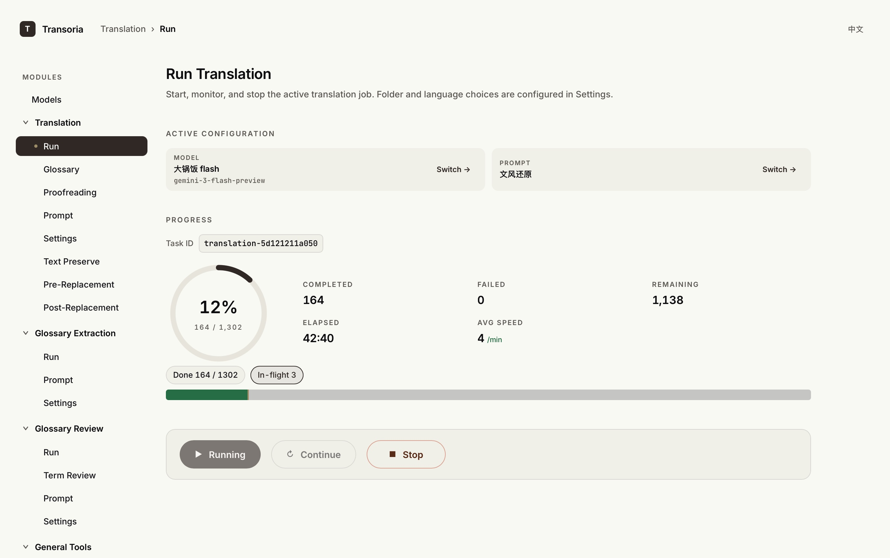
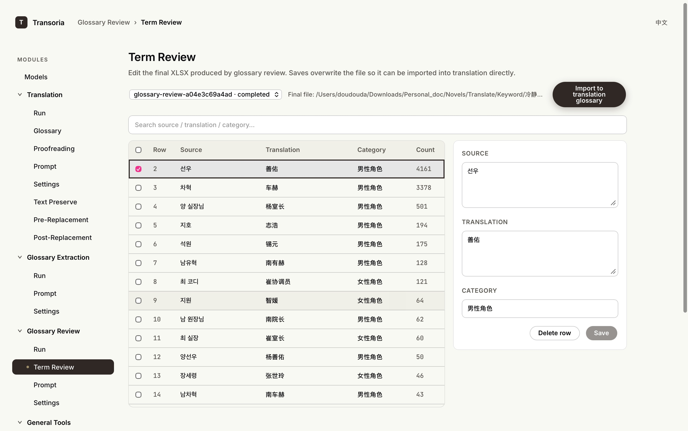

# Transoria

<p align="center">
  <strong><a href="#中文">中文</a></strong> ·
  <strong><a href="#english">English</a></strong>
</p>

## 中文

Transoria 是一个面向小说翻译的桌面应用：把 EPUB / TXT 小说交给它，得到翻译完成后的同结构输出。核心工作流包括 **术语提取**、**术语审查**、**翻译**、**校对**、**批量文本替换** 和 **EPUB 工具**。

界面支持中英文切换。所有任务在本地运行，由你自己的 LLM API Key 调用模型。





交流/问题反馈群 QQ：**1104197845**。欢迎加入，使用中遇到问题可以进群反馈。

### 版权与使用声明

Transoria 只是本地翻译辅助工具，不拥有、不分发、也不授权任何原作或译文版权。使用本项目处理小说、游戏文本、字幕或其他内容时，请自行确认你拥有相应权利，或已获得原作者 / 版权方允许，并遵守所在地法律法规与发布平台规则。

如果你觉得 Transoria 好用，欢迎推荐给身边有类似需求的朋友。若公开发布了由本项目辅助翻译、校对或整理的作品，也欢迎在作品信息、发布页或说明中标注使用了 **Transoria**。

### 最近更新

- 新增独立的 **术语审查** 模块：读取 XLSX 术语表，结合参考 TXT 做多轮 AI 审查，输出最终 XLSX。
- 术语审查支持候选文件选择、参考 TXT 多选、断点续跑、轮次进度、改动报告、最终表格编辑、多选删除和撤回删除。
- 审查完成后可一键把最终 XLSX 导入翻译术语表；如果已有术语表内容，会询问清空导入还是追加导入。
- 新增 **EPUB 合并** 和 **EPUB 压缩**：可按顺序合并多本 EPUB、重建目录、去重资源、压缩图片；也可用单本合并来重命名书内标题。
- EPUB 解析更稳：兼容部分第三方工具或手动加封面造成的异常 XHTML 结构，减少整章漏翻风险。
- 翻译运行页显示当前 task ID，避免和校对页里旧任务混淆；失败后可继续重跑失败分块。
- 校对页支持风险优先排序、低置信度分组、原文残留标签、疑似相邻重复标签、批量/正则替换、原文复制、多选和批量重翻。
- 翻译质量链路增强：缺行只重试缺失行，低置信度段落单条重试，自动剥离 EPUB 隐形水印，尽量避免原文残留、重复段落和原译文错位。
- 底栏 token 标签可点击查看实时 input / output / total 明细。
- 运行中禁止清理任务缓存，避免缓存写入冲突。

完整列表见 [Releases](https://github.com/oodadoudou/Transoria/releases)。

### 推荐工作流

1. 在「**术语提取**」里从小说原文生成术语表 XLSX 和参考 TXT。
2. 在「**术语审查**」里选择术语表和参考 TXT，运行多轮审查。
3. 审查完成后，在术语审查页校对最终表格；需要时查看改动报告并撤回误删条目。
4. 点击「导入到翻译术语表」，选择清空导入或追加导入。
5. 在「**翻译**」里运行小说翻译。
6. 翻译完成后进入「**校对**」，优先检查低置信度、原文残留和格式救援条目，修改后重新生成输出。

如果只需要整理 EPUB，可直接使用「**通用工具 → EPUB 合并 / EPUB 压缩**」。合并工具适合多卷合并、目录重建和书内标题重命名；压缩工具适合减小 EPUB 体积并去重封面、字体、图片等资源。

### 下载安装包

最新版下载：**[GitHub Releases](https://github.com/oodadoudou/Transoria/releases)**

- **macOS** — `Transoria.dmg`，挂载后把 `Transoria.app` 拖到 `/Applications/`。首次启动若被 Gatekeeper 拦截，参考对应 Release 描述里的「macOS 用户须知」。
- **Windows** — `Transoria-windows.zip`。解压前请右键 ZIP → 属性 → 解除锁定 → 应用，再解压到一个普通可写目录（如「文档」或「桌面」），双击 `Transoria.exe`。若安装目录不可写，用户数据会自动改存到 `%LOCALAPPDATA%\Transoria`。包内 `README_CN.txt` 有完整说明。

### 跑源码（不用安装包）

适用场景：自定义 / 调试 / 在 Linux 上跑 / 安装包遇到问题想绕过。

**前置依赖**：Python ≥ 3.11、Node.js ≥ 18、[uv](https://github.com/astral-sh/uv)（推荐）或 `pip`。

#### macOS / Linux

```bash
git clone https://github.com/oodadoudou/Transoria.git
cd Transoria

# 后端依赖（含桌面 shell 所需）
uv sync --extra gui --extra dev
# 或： python -m pip install -e ".[gui,dev]"

# 前端构建
cd frontend
npm install
npm run build
cd ..

# 启动桌面应用
python app.py
```

#### Windows（PowerShell）

```powershell
git clone https://github.com/oodadoudou/Transoria.git
cd Transoria

# 后端依赖
python -m pip install -e ".[gui,dev]"

# 前端构建
cd frontend
npm install
npm run build
cd ..

# 启动桌面应用
python app.py
```

### 启动后第一步

1. 在「**模型**」页面新增或选择一个 LLM 配置，填入 API Key（DeepSeek / OpenAI / Anthropic / Google / 火山引擎 Ark 等均支持）。
2. 进入要使用的模块：**翻译**、**术语提取**、**术语审查** 或 **通用工具**。
3. 在该模块的「**设置**」页指定输入、输出和模型相关配置。
4. 回到「**运行**」页面点开始。

进度、token 用量、失败重试、日志都会在运行页面实时显示。

---

## English

Transoria is a desktop app for novel translation: provide EPUB / TXT novels and get translated files back in the same folder structure. The main workflow includes **Glossary Extraction**, **Glossary Review**, **Translation**, **Proofreading**, **Batch Text Replacement**, and **EPUB Tools**.

The UI ships with both Chinese and English. All tasks run locally and call models via your own LLM API key.

> The UI can be switched between Chinese and English from the top-right of the app.





### Copyright and Usage Notice

Transoria is a local translation-assistance tool. It does not own, distribute, or grant rights to any original work or translated work. Before processing or publishing novels, game text, subtitles, or other content with this project, make sure you have the necessary rights or permission from the author / copyright holder, and follow applicable laws and platform rules.

If Transoria is useful to you, feel free to recommend it to friends who may need it. If you publicly release work translated, proofread, or organized with help from this project, a mention of **Transoria** in the work information, release page, or notes is appreciated.

### What's new

- Added a standalone **Glossary Review** module: review XLSX glossaries against reference TXT files with multi-round AI review, then export a final XLSX.
- Glossary Review supports candidate file selection, multi-select reference TXT files, resume from cache, round-aware progress, change reports, final table editing, multi-select deletion, and restoring deleted rows.
- After review, one click imports the final XLSX into the translation glossary. If existing entries are present, the app asks whether to replace or append.
- Added **EPUB Merge** and **EPUB Compression**: merge EPUBs in order, rebuild navigation, deduplicate resources, compress images, and use single-file merge to rename the book title when needed.
- EPUB parsing is more tolerant of malformed XHTML produced by third-party tools or manual cover insertion, reducing the risk of untranslated chapters.
- Translation Run now shows the active task ID so users can distinguish the running task from older proofreading tasks; failed chunks can be continued.
- Proofreading supports risk-first sorting, low-confidence grouping, source-residue tags, possible adjacent-duplicate tags, batch / regex replacement, copyable source text, multi-select, and batch retranslation.
- Translation quality recovery is stronger: missing lines retry alone, low-confidence segments retry one by one, invisible EPUB watermarks are stripped, and the runner works harder to avoid source residue, duplicate paragraphs, and alignment drift.
- Clickable token chip with live input / output / total breakdown.
- Cache cleanup is disabled while tasks are running to avoid write conflicts.

Full list on [Releases](https://github.com/oodadoudou/Transoria/releases).

### Recommended Workflow

1. Use **Glossary Extraction** to generate a glossary XLSX and reference TXT files from the source novel.
2. Use **Glossary Review** to select the glossary and reference TXT files, then run multi-round review.
3. After review, edit the final glossary table in the app; inspect the change report and restore any incorrectly deleted entries if needed.
4. Click **Import to Translation Glossary**, then choose whether to replace existing entries or append to them.
5. Run the novel translation in **Translation**.
6. After completion, open **Proofreading** and prioritize low-confidence, source-residue, and format-rescue entries before regenerating outputs.

For EPUB-only maintenance, use **General Tools → EPUB Merge / EPUB Compression**. Merge is useful for volume merging, navigation rebuilding, and book-title renaming; compression is useful for reducing file size and deduplicating covers, fonts, images, and related resources.

### Download

Latest builds: **[GitHub Releases](https://github.com/oodadoudou/Transoria/releases)**

- **macOS** — `Transoria.dmg`. Mount the DMG and drag `Transoria.app` into `/Applications/`. If Gatekeeper blocks the first launch, see the "Notes for macOS users" section of the release description.
- **Windows** — `Transoria-windows.zip`. Before extracting, right-click the ZIP → Properties → Unblock → Apply. Extract to a regular writable folder (Documents, Desktop, or a folder you create, not Program Files), then double-click `Transoria.exe`. If the install folder is not writable, user data automatically falls back to `%LOCALAPPDATA%\Transoria`. Full instructions in the bundled `README_EN.txt`.

### Run from source (no installer)

Use this if you want to customize / debug / run on Linux / sidestep packaging issues.

**Prerequisites**: Python ≥ 3.11, Node.js ≥ 18, [uv](https://github.com/astral-sh/uv) (recommended) or `pip`.

#### macOS / Linux

```bash
git clone https://github.com/oodadoudou/Transoria.git
cd Transoria

# Backend dependencies (incl. desktop shell)
uv sync --extra gui --extra dev
# or: python -m pip install -e ".[gui,dev]"

# Frontend build
cd frontend
npm install
npm run build
cd ..

# Launch the desktop app
python app.py
```

#### Windows (PowerShell)

```powershell
git clone https://github.com/oodadoudou/Transoria.git
cd Transoria

# Backend dependencies
python -m pip install -e ".[gui,dev]"

# Frontend build
cd frontend
npm install
npm run build
cd ..

# Launch the desktop app
python app.py
```

### After launch

1. Open the **Model** page, add or pick an LLM configuration, and paste in your API key (DeepSeek / OpenAI / Anthropic / Google / Volcengine Ark are all supported).
2. Open the module you want to use: **Translation**, **Glossary Extraction**, **Glossary Review**, or **General Tools**.
3. Configure input, output, and model-related settings on that module's **Settings** page.
4. Back on the **Run** page, click Start.

Progress, token usage, retry counts, and logs all stream live on the run page.
